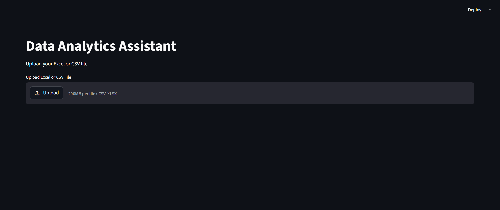
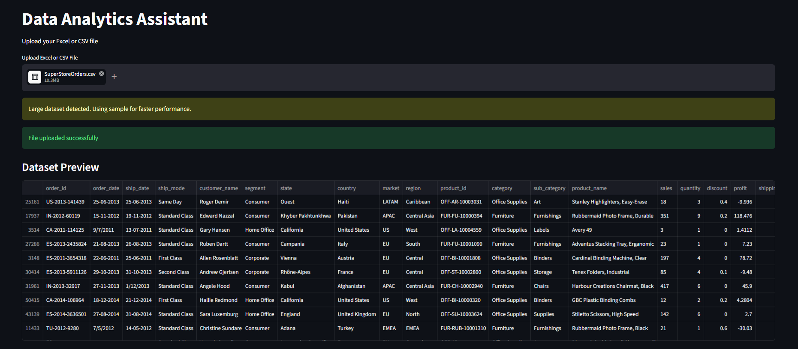
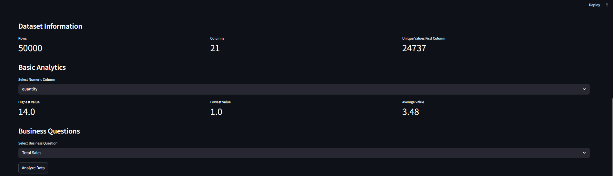
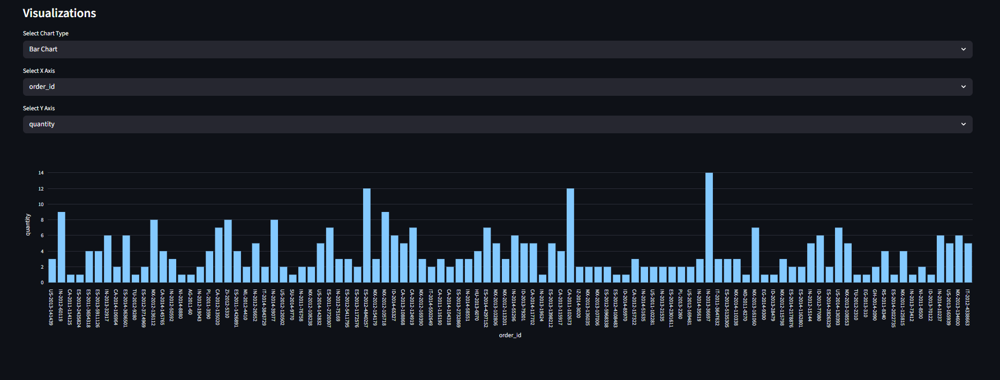

📊 Data Analytics Assistant

An AI-powered Data Analytics Assistant built using Python and Streamlit.

This application allows users to upload CSV or Excel datasets and interactively explore, analyze, and visualize data through an easy-to-use interface.

---
📁 Sample Dataset Included

A dummy dataset named `SuperStoreOrders.csv` has been included in the project for testing, analytics, and visualization purposes.

---

🚀 Features

* Upload CSV and Excel files
* Interactive data preview
* Automated data analysis
* Charts and visualizations
* Business insights generation
* AI-assisted analytics workflow
* User-friendly Streamlit interface

---

🛠️ Tech Stack

* Python
* Streamlit
* Pandas
* Plotly

---

📂 Project Structure

```bash
data-analytics-assistant/
│
├── app.py
├── ai_helper.py
├── requirements.txt
├── README.md
├── SuperStoreOrders.csv
├── screenshots/
└── .gitignore
```

---

▶️ Installation

### Clone Repository

```bash
git clone https://github.com/RitwamMukhopadhyay/data-analytics-assistant.git
```

### Create Virtual Environment

```bash
python -m venv venv
```

### Activate Virtual Environment

#### Windows

```bash
venv\Scripts\activate
```

### Install Dependencies

```bash
pip install -r requirements.txt
```

### Run Application

```bash
streamlit run app.py
```

---


📸 Screenshots

### Home Screen



---

### Dataset Preview



---

### Analytics Dashboard



---

### Data Visualization



---

🎯 Future Improvements

* Advanced AI insights
* Dashboard enhancements
* Natural language querying
* Predictive analytics integration
* Database connectivity

---

👨‍💻 Author

Dr. Ritwam Mukhopadhyay

Pharm D (Doctor Of Pharmacy) | Aspiring Data Analyst & AI Enthusiast